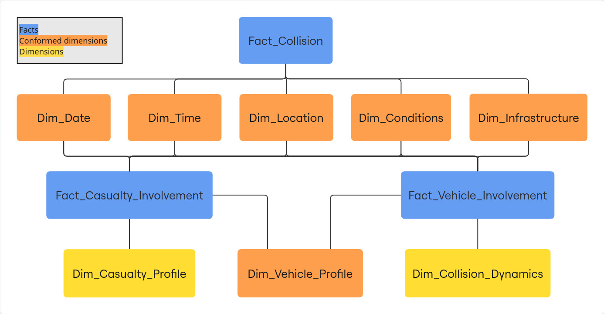
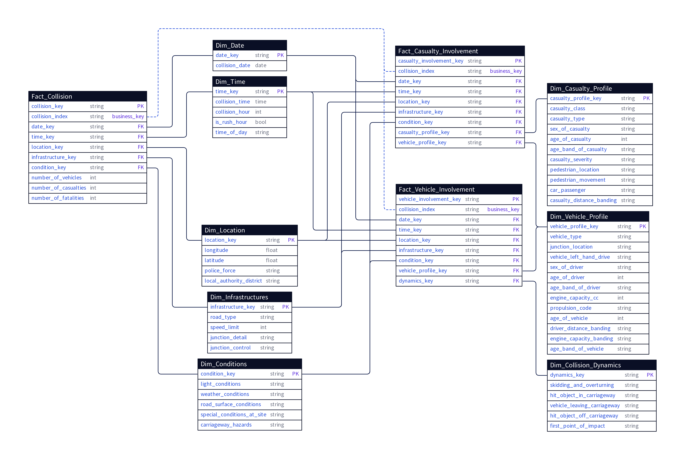

# Hurtownia Danych Stats19 (Road Safety Data Pipeline)

Projekt zawiera implementację potoku przetwarzania i transformacji brytyjskich danych o wypadkach drogowych (Stats19). Dane są czyszczone, transformowane do modelu wielowymiarowego, a następnie wizualizowane w panelu analitycznym.

## Architektura Systemu

Poniższy diagram przedstawia ogólny przepływ danych (data flow) w systemie:



Dane pobierane są ze źródeł, a następnie ładowane do analitycznej bazy danych. Następnie poddawane są wielowarstwowej transformacji, czyszczeniu oraz modelowaniu do ustrukturyzowanej formy, przygotowanej na potrzeby warstwy wizualizacji.

## Model Danych

Struktura hurtowni danych bazuje na wielowymiarowym modelu danych w architekturze konstelacji faktów. Została zaprojektowana pod kątem wydajności zapytań analitycznych oraz zachowania znormalizowanej reprezentacji współdzielonych wymiarów. Szczegółowy schemat relacji między tabelami faktów i wymiarów został załączony na końcu niniejszego dokumentu.

## Struktura Katalogu Projektu

Poniższe drzewo przedstawia strukturę plików w katalogu `dbt_project/` wraz z opisem przeznaczenia poszczególnych warstw transformacji:

```text
dbt_project/
└── models/
    ├── staging/                  # Warstwa wejściowa (Staging) - definicje zewnętrznych źródeł
    │   ├── src_stats19.yml       # Konfiguracja zewnętrznych plików CSV i ich parametrów
    │   ├── stg_casualties.sql    # Widok mapujący dane o ofiarach wypadków
    │   ├── stg_collisions.sql    # Widok mapujący dane o samych zdarzeniach (kolizjach)
    │   └── stg_vehicles.sql      # Widok mapujący dane o pojazdach
    │
    ├── intermediate/             # Warstwa pośrednia - czyszczenie, unifikacja typów i wyliczanie kluczy zastępczych
    │   ├── int_casualties.sql    # Wstępne czyszczenie i standaryzacja danych o ofiarach
    │   ├── int_collisions.sql    # Wyliczanie atrybutów czasowych (np. rush hour, pory dnia), integracja danych o ofiarach śmiertelnych
    │   └── int_vehicles.sql      # Transformacje i standaryzacja danych o pojazdach
    │
    └── marts/                    # Warstwa docelowa (Marts) - gotowe struktury analityczne
        ├── constellation/        # Wielowymiarowy model gwiazdy/konstelacji
        │   ├── dim_*.sql         # Tabele wymiarów (np. lokalizacja, czas, warunki atmosferyczne, profil uczestnika)
        │   ├── fact_*.sql        # Tabele faktów (np. fact_collision, fact_vehicle_involvement)
        │   └── constellation.yml # Definicje asercji testowych dla modelu wielowymiarowego
        │
        └── obt/                  # Modele typu OBT (One Big Table) pod wizualizację w BI
            ├── obt_collision.sql # Płaska, szeroka tabela denormalizująca fakty i wymiary kolizji
            ├── obt_casualty.sql  # Zdenormalizowany model dedykowany analizie ofiar zdarzeń
            ├── obt_vehicle.sql   # Zdenormalizowany model dedykowany analizie pojazdów
            └── obt.yml           # Konfiguracja semantyczna metryk i wymiarów dla integracji z Lightdash
```

## Wykorzystane Technologie

Główne elementy potoku danych to:

### 1. [DuckDB](https://duckdb.org/docs/)
DuckDB to analityczny system zarządzania relacyjnymi bazami danych działający wewnątrz procesu (in-process). Wykorzystuje wektorowy silnik zapytań zoptymalizowany pod kątem obciążeń OLAP. Pozwala na przetwarzanie dużych wolumenów danych bez konieczności wdrażania dedykowanego serwera bazodanowego.

### 2. [MotherDuck](https://motherduck.com/)
MotherDuck to chmurowa platforma bazodanowa ściśle zintegrowana z DuckDB. Umożliwia hostowanie baz danych w chmurze, bezserwerowe wykonywanie zapytań SQL oraz realizację zapytań hybrydowych (łączących lokalne dane z danymi w chmurze). W projekcie stanowi docelowe środowisko produkcyjne.

### 3. [dbt (Data Build Tool)](https://docs.getdbt.com/)
dbt to framework do zarządzania transformacjami danych wewnątrz bazy danych (warstwa Transform w architekturze ELT). Umożliwia pisanie transformacji w formie parametryzowanych zapytań SQL z wykorzystaniem języka szablonów Jinja. 

W dbt modele danych definiuje się jako niezależne zapytania `SELECT`. System automatycznie generuje skierowany graf acykliczny (DAG), zarządzając kolejnością materializacji obiektów bazy danych na podstawie ich wzajemnych zależności. Projekt wykorzystuje trzy kluczowe mechanizmy dbt:

- **Modele Inkrementalne:**
  Mechanizm materializacji ładujący do docelowej tabeli jedynie nowe lub zmodyfikowane rekordy z warstwy źródłowej, zamiast wykonywania operacji na pełnym zbiorze (*full refresh*). Wykorzystuje strategię *idempotent append* w oparciu o unikalny klucz główny. Optymalizuje to zużycie zasobów podczas przetwarzania przyrostowego.
- **Testowanie Jakości Danych:**
  System obsługuje asercje danych definiowane na dwóch poziomach:
  - *Testy generyczne:* Deklaratywne reguły konfigurowane w plikach YAML (np. weryfikacja unikalności kluczy, braku wartości NULL, sprawdzanie integralności referencyjnej z tabelami wymiarów).
  - *Testy niestandardowe:* Bezpośrednie zapytania SQL uruchamiane w ramach cyklu przetwarzania, które wymuszają sprawdzenie specyficznych ograniczeń biznesowych, zwracając błąd w przypadku zidentyfikowania odchyleń.
- **Separacja środowisk (Targets):**
  Konfiguracja profili połączeń pozwala na przełączanie bazy docelowej za pomocą parametru `--target`. Domyślne uruchomienie wykonuje transformacje na lokalnej bazie DuckDB (środowisko deweloperskie), natomiast wskazanie `--target prod` przenosi wykonanie zapytań i zapis wyników do chmurowej bazy MotherDuck, bez konieczności modyfikacji kodu SQL modeli.

Uruchamianie testów blokuje przetwarzanie niespójnych danych w dalszych etapach potoku. Ponadto narzędzie generuje dokumentację na podstawie kodu i konfiguracji w plikach projektu.

### 4. [Lightdash](https://docs.lightdash.com/)
Lightdash to platforma Business Intelligence natywnie zintegrowana z dbt. Umożliwia definiowanie metryk i wymiarów analitycznych bezpośrednio w plikach konfiguracyjnych YAML warstwy semantycznej projektu dbt. Definicje te stanowią wspólne źródło prawdy, na podstawie których narzędzie dynamicznie generuje zapytania SQL odpowiedzialne za renderowanie elementów interfejsu wizualnego.

## Główne cechy potoku danych
1. **Deklaratywność i wersjonowanie:** Schemat bazy, reguły transformacji oraz definicje raportów są w całości opisane w kodzie i wersjonowane w systemie Git.
2. **Weryfikacja danych:** Testy poprawności i relacji są automatycznie wykonywane podczas każdego uruchomienia potoku transformacji.
3. **Wydajność lokalna:** Przetwarzanie i agregowanie milionów rekordów odbywa się w pamięci RAM (in-memory) na lokalnym komputerze, bez konieczności uruchamiania zewnętrznych usług lub serwerów bazodanowych.

## Instrukcja lokalnego uruchomienia

### 1. Przygotowanie środowiska Python
Projekt zarządza zależnościami za pomocą `pyproject.toml`. Należy utworzyć środowisko wirtualne i zainstalować wymagane pakiety:

```bash
# Utworzenie i aktywacja środowiska wirtualnego
python -m venv .venv
source .venv/bin/activate

# Instalacja pakietów zdefiniowanych w projekcie
pip install .
```

### 2. Pobranie danych źródłowych
Dane wejściowe pochodzą z oficjalnego portalu brytyjskiego [UK Road Safety Open Data](https://www.gov.uk/government/statistical-data-sets/road-safety-open-data).
Należy pobrać odpowiednie pliki CSV (wypadki/collisions, pojazdy/vehicles, ofiary/casualties) i umieścić je w katalogu `~/data/dft-incremental/`. Wzorce nazw plików to:
- `dft-road-casualty-statistics-collision-*.csv`
- `dft-road-casualty-statistics-casualty-*.csv`
- `dft-road-casualty-statistics-vehicle-*.csv`

*(Uwaga: Podane tu wartości są moimi własnymi domyślnymi ścieżkami. Można je dostosować w pliku konfiguracyjnym `dbt_project/models/staging/src_stats19.yml`)*.

### 3. Przygotowanie dbt
Przejdź do katalogu projektu dbt i pobierz pakiety zewnętrzne (np. dbt-utils):

```bash
cd dbt_project
dbt deps
```

Konfiguracja połączenia z bazą danych znajduje się w pliku `~/.dbt/profiles.yml`. Należy utworzyć w nim profil o nazwie `warehouse`. 

Środowisko produkcyjne (`prod` korzystające z MotherDuck) jest opcjonalne – do lokalnego uruchomienia wystarczy konfiguracja środowiska deweloperskiego (`dev`).

Przykładowy szablon pliku `profiles.yml`:

```yaml
warehouse:
  target: dev
  outputs:
    dev:
      type: duckdb
      path: "/sciezka/do/lokalnego/pliku/stats19.duckdb"
      schema: main
      threads: 2
    
    # Konfiguracja opcjonalna
    prod:
      type: duckdb
      path: "md:stats19?motherduck_token=<TWÓJ_TOKEN_MOTHERDUCK>"
      schema: main
      threads: 4
```


### 4. Wykonanie potoku transformacji i testów
W celu uruchomienia całego procesu przetwarzania danych (budowy tabel i widoków) oraz automatycznego wykonania testów jakości danych, należy wywołać:

```bash
# Uruchomienie lokalne (DuckDB)
dbt build

# Uruchomienie produkcyjne (MotherDuck)
dbt build --target prod
```

## Załącznik: Schemat Modelu Wielowymiarowego

Poniższy diagram przedstawia strukturę logiczną konstelacji faktów (tabele faktów oraz współdzielone tabele wymiarów) zaimplementowaną w warstwie `marts/constellation/`:


